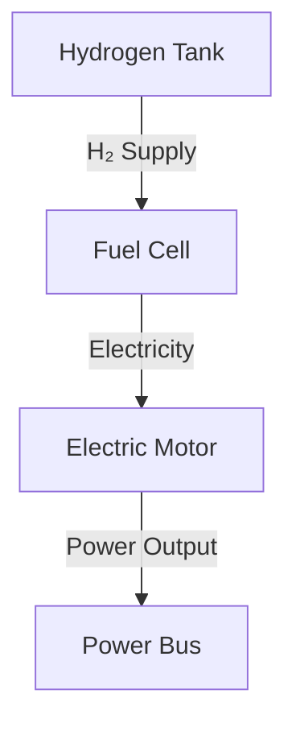
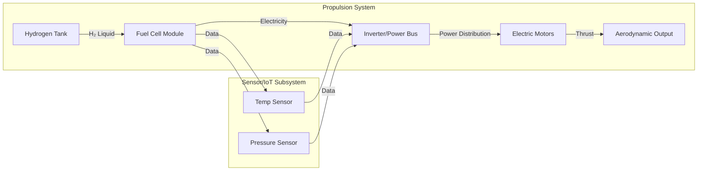

# MT-PTS-SYS-ARCH-V01

**Token Name:** MT-PTS-SYS-ARCH-V01  
**Domain:** PTS (Technical Specifications of the System)  
**Function:** Define and represent the system architecture at conceptual, logical, and physical levels. Produce standardized diagrams (functional, logical, physical) using GenAI and digital analogies. This token guides the creation of Mermaid diagrams that fit S1000D, STE, MTL, and other standards.

## Description

This token provides a standard method to create and document system architectures. It integrates digital analogies, GenAI, and MTL. By using STE prompts and MTL methods, you can generate functional, logical, and physical diagrams. Mermaid helps produce and version text-based diagrams, which you can store in version control systems and CI/CD pipelines.

## Objectives

- Provide a clear method to create architecture views (functional, logical, physical) with GenAI and digital analogies.  
- Use Mermaid to edit, update, and version text-based diagrams easily.  
- Ensure document consistency with MTL, S1000D, STE, ATA, FAA, and EASA.  
- Reduce manual effort, improving traceability and documentation quality.

## Scope

- **Application:** During PTS definition and design updates.  
- **Systems/Subsystems:** Propulsion (H2), Avionics (NAV, COM), Electric (ELE), Hydraulic (HYD), IoT, AI.  
- **Tools:** GenAI for CAD-like images, Mermaid for text-based diagrams, Configuration Management (CM) repositories.

## Inputs and Prerequisites

- STE descriptions of the system (functional/non-functional, parameters, limits).  
- Defined digital analogies.  
- Defined related MTL tokens (e.g., `MT-PTS-BOM-GEN-V01`, `MT-PTS-IFD-DATA-V01`).

## Procedure

1. **Select the Level of Abstraction:**  
   Choose if you need a functional, logical, or physical diagram.

2. **Create the STE Prompt and Digital Analogy:**  
   Write a prompt in STE. Describe nodes, flows, and relationships.  
   Example:
   

    %% This diagram shows a simple flow of resources from the Hydrogen Tank 
    %% through the Fuel Cell, then the Electric Motor, and finally to the Power Bus.
 
  ```  
flowchart TD
    A[Hydrogen Tank] -->|H₂ Supply| B[Fuel Cell]
    B -->|Electricity| C[Electric Motor]
    C -->|Power Output| D[Power Bus]
 ```

4. **Generate the Mermaid Diagram:**  
   Use the prompt to create a Mermaid diagram. You can do this manually or with GenAI suggestions.

   
Below is a clean, consolidated version of the provided Mermaid diagrams and instructions. It presents two examples:

1. A simple top-down flowchart showing hydrogen supply through various components.
2. A more detailed left-right graph with subsystems (Propulsion System and Sensor/IoT Subsystem).

Both are in Mermaid syntax, ready to be edited in any Mermaid-compatible tool.

---

### Example 1: Simple Flowchart (Top-Down)

This diagram shows a simple flow of resources from the Hydrogen Tank through the Fuel Cell, then the Electric Motor, and finally to the Power Bus.



**Notes:**  
- The arrow labels clearly indicate what each transition represents.
- The layout is top-down (TD) for a straightforward, vertical flow.

---

### Example 2: Detailed Diagram with Subsystems (Left-Right)

Below is a more complex diagram, including subsystems for propulsion and sensors. It uses a left-right (LR) orientation and more detailed nodes and labels.



**Notes:**  
- This diagram uses `graph LR` for a left-to-right flow.
- The `Propulsion_System` subgraph groups all propulsion-related components.
- The `Sensors_IoT` subgraph groups sensor components.
- Data flows from the Fuel Cell Module to sensors, and then from sensors back to the Inverter/Power Bus node.
- Labels on arrows clarify the type of resource or signal being transferred.

---

**Next Steps:**

- You can adjust node names, add more components, or integrate this diagram into a documentation pipeline (e.g., S1000D-based manuals, PTS reports, or MTL-based procedures).
- If using GenAI, you can prompt the model to refine the diagram’s layout or suggest different icons and node shapes.
- Store the Mermaid code in version control for easy updates and traceability.

   This diagram shows hydrogen flow from the tank to the fuel cell, electrical energy distribution to motors, and data flow from sensors to the power bus. GenAI can refine symbols or generate SVG/PNG output.

5. **Integrate with GenAI and MTL Tokens:**  
   - Enrich the diagram with GenAI-generated icons.  
   - Reference MTL tokens (e.g., `MT-H2-FC-INS-V01`) in notes or metadata.  
   - Link nodes to Data Modules (e.g., `B[Fuel Cell Module (GAA-7200-SD-00-E-0001)]`).

6. **Version Control and CM:**  
   - Store Mermaid code in a CM repository.  
   - Each commit links to a version of MT-PTS-SYS-ARCH-V01 and the PTS revision.

7. **Validation and Review:**  
   - The engineering team reviews the diagram.  
   - Adjust prompts or Mermaid code if necessary.  
   - Use GenAI for more detail (e.g., 3D views or physical layouts).

## Outputs and Results

- **Outputs:**
  - Mermaid code for functional/logical/physical diagrams.  
  - Generated images (SVG, PNG) from Mermaid and GenAI.  
  - Metadata with links to other Data Modules and MTL tokens.

- **Results:**
  - Standardized, easily versioned and updated graphical documentation.  
  - Material ready for S1000D manuals, PTS reports, or ALM/PLM tools.

## Integration with Other MTL Tokens

- `MT-PTS-BOM-GEN-V01`: Assists in placing components in the BOM using the architecture.  
- `MT-PTS-IFD-DATA-V01`: The diagram’s communication lines support Interface Control Documents.  
- `MT-FMEA-ANL-V01`: The diagram helps identify critical nodes for reliability analysis.

## Safety and Standards Considerations

- Maintain STE to reduce ambiguity.  
- Follow S1000D/ATA for component codes.  
- Ensure digital analogies do not cause confusion; the diagram is representative, not exact.

---

**End of Document MT-PTS-SYS-ARCH-V01 (STE Version)**  
