# GAIA-AIR-Ampel360XWLRGA
## AMPEL360 Extra Wide Body Long Range Green AIRCRAFT

```mermaid
graph TD
    A[A360XWLRGA Long-Range Aircraft Overview]
    A --> B[Diffusp Concept Zer0 Emissions, Hydrogen-based]
    
    B --> C[Hydrogen Fuel Cells]
    C --> C1[High-Efficiency Conversion]
    C --> C2[Green Hydrogen Sourcing]
    C --> C3[Reduced Carbon Footprint]
    
    B --> D[Cryogenic Storage Tanks]
    D --> D1[Advanced Insulation]
    D --> D2[Liquid Hydrogen Storage]
    D --> D3[Long-Range Fuel Capacity]
    
    B --> E[Distributed Electric Propulsion]
    E --> E1[Motors Along Wings/Fuselage]
    E --> E2[Boundary Layer Ingestion]
    E --> E3[Aerodynamic Optimization]
    E --> E4[Redundancy & Safety]
    
    B --> F[IoT-based Sensors and Actuators]
    F --> F1[Real-Time Data Collection Pressure, Temp, Vibration]
    F --> F2[Predictive Maintenance Input]
    F --> F3[Continuous Performance Monitoring]
    F --> F4[Secure, Encrypted Data Transmission]
    
    B --> G[AI-Driven Data Analysis]
    G --> G1[Predictive Analytics for Maintenance]
    G --> G2[Route Optimization & Efficiency]
    G --> G3[Real-Time Fault Detection]
    G --> G4[Maintenance Scheduling & Resource Allocation]
    
    B --> H[Documentation & Standards]
    H --> H1[S1000D Integration]
    H1 --> H11[Data Modules for Maintenance Steps]
    H1 --> H12[Structured Technical Content]
    H1 --> H13[Global Aviation Documentation Compatibility]
    
    H --> H2[MTL Methods Token Library]
    H2 --> H21[Standardized Method Tokens MT-DOMAIN-METHODID-VERSION>]
    H2 --> H22[Single-Source Updates for Procedures]
    H2 --> H23[Easy Integration with Maintenance Documents]
    
    H --> H3[Compliance & Governance]
    H3 --> H31[Adherence to ATA Chapters]
    H3 --> H32[Regulatory FAA, EASA Alignment]
    H3 --> H33[Audit-Ready, Immutable Maintenance Logs]
    
    %% Optional: Styling Nodes for Better Visualization
    classDef tech fill:#f9f,stroke:#333,stroke-width:2px;
    class C,D,E,F,G,H tech;

```

Below is the updated **Integral Document for the GAIA AIR Program**. In this version, the Data Module Codes (DMCs) have been assigned in compliance with S1000D standards, while maintaining compatibility with legacy ATA references as previously validated. The final DMC format incorporates:

- **MIC (Model Identification Code):** GAA  
- **ATA-based SNS codes:** Derived from ATA chapter references for each system/subsystem  
- **S1000D Information Codes:** Mapping old suffixes (DES, MNT, etc.) to S1000D Info Codes (SD, MP, FI, IP, OP, WD, MT, CT, etc.)  
- **ICN:** Preserving original numeric identifiers (with adjustments when necessary)  
- **Language Code:** E (English)

This approach allows maintainers to navigate using familiar ATA chapters while leveraging the modularity, reusability, and digital integration benefits of S1000D.

---

This final document is structured as follows:

1. GAIA AIR AMPEL Model program documentation (S1000D-oriented and IoT/AI integrated)  
2. Methods Token Library (MTL) integration and standard specification, fully compliant with S1000D and ATA references  
3. Demonstrations of how ATA-based SNS codes, ICNs, and Info Codes have been applied to Data Module Codes (DMCs)  
4. Recommendations, governance frameworks, security considerations, multilingual support, and advanced techniques (QCM, ALM, BIT) fully incorporated.

---

# GAIA AIR Program: AMPEL Model with IoT, AI, Digital Analogy, and S1000D Compliance

**Author:** Amedeo Pelliccia  
**Date:** December 2024, Madrid  
**Security Classification:** [CALL FOR COLLABORATION]

*(This document is a conceptual representation and should be complemented with project-specific technical data and studies. Consultation with aerospace engineering and sustainability experts is recommended for full-scale implementation.)*

---

## Table of Contents

1. [Introduction](#1-introduction)
   - [Document Objective](#document-objective)
   - [Scope](#scope)
   - [Definitions and Abbreviations](#definitions-and-abbreviations)

2. [GAIA AIR System Description](#2-gaia-air-system-description)
   - [System Overview](#system-overview)
   - [Zero-Emission Sustainability Principles](#zero-emission-sustainability-principles)
   - [Key Components](#key-components)

3. [AMPEL Model for GAIA AIR](#3-ampel-model-for-gaia-air)
   - [A: Architecture](#a-architecture)
   - [M: Materials](#m-materials)
   - [P: Propulsion](#p-propulsion)
   - [E: Efficiency](#e-efficiency)
   - [L: Lifecycle](#l-lifecycle)

4. [IoT and AI Integration](#4-iot-and-ai-integration)
   - [Aircraft IoT Architecture](#aircraft-iot-architecture)
   - [Integration with Air Traffic IoT](#integration-with-air-traffic-iot)
   - [Connection to Digitized Space Sector IoT](#connection-to-digitized-space-sector-iot)
   - [Interoperability, Security, and Data Management](#interoperability-security-and-data-management)
   - [Strategic Database for AI Training](#strategic-database-for-ai-training)

5. [Digital Analogy vs. Digital Twin](#5-digital-analogy-vs-digital-twin)
   - [Digital Analogy Concept and Scope](#digital-analogy-concept-and-scope)
   - [Difference from Digital Twin](#difference-from-digital-twin)
   - [Applications in Design, Operation, and Maintenance](#applications-in-design-operation-and-maintenance)

6. [Operational Procedures](#6-operational-procedures)
   - [Deployment and Operational Sequences](#deployment-and-operational-sequences)
   - [Flight Procedures](#flight-procedures)
   - [Shutdown, Repositioning, and Recovery](#shutdown-repositioning-and-recovery)

7. [Maintenance Procedures (S1000D)](#7-maintenance-procedures-s1000d)
   - [Preventive Maintenance](#preventive-maintenance)
   - [Corrective Maintenance](#corrective-maintenance)
   - [RCM and FMEA Integration](#rcm-and-fmea-integration)
   - [Predictive Maintenance with AI](#predictive-maintenance-with-ai)

8. [Fault Isolation and Troubleshooting](#8-fault-isolation-and-troubleshooting)
   - [Fault Isolation Diagrams](#fault-isolation-diagrams)
   - [Troubleshooting Guide](#troubleshooting-guide)

9. [Training and Simulation](#9-training-and-simulation)
   - [Training Models (MT, ODT, IDT, STT)](#training-models-mt-odt-idt-stt)
   - [Use of AR/VR and Digital Analogy in Training](#use-of-arvr-and-digital-analogy-in-training)
   - [Tactical and Collective Scenarios](#tactical-and-collective-scenarios)

10. [Illustrated Product Breakdown (IPB)](#10-illustrated-product-breakdown-ipb)
    - [Diagrams and Part Numbers](#diagrams-and-part-numbers)
    - [Maintenance Planning and Logistics](#maintenance-planning-and-logistics)
    - [Parts Catalog](#parts-catalog)

11. [Appendices and References](#11-appendices-and-references)
    - [References to Original Technical Manuals](#references-to-original-technical-manuals)
    - [Glossary of Terms and Acronyms](#glossary-of-terms-and-acronyms)

12. [Conclusions](#12-conclusions)

13. [Next Steps and Recommendations](#13-next-steps-and-recommendations)

14. [Block 0: AI Assistant Contribution](#14-block-0-ai-assistant-contribution)

15. [Methods Token Library (MTL) Standard Specification](#15-methods-token-library-mtl-standard-specification)
    - [Purpose and Scope](#purpose-and-scope)
    - [MTL Token Format](#mtl-token-format)
    - [Metadata and Content Structure](#metadata-and-content-structure)
    - [Versioning and Lifecycle Governance](#versioning-and-lifecycle-governance)
    - [Integration and Interoperability (S1000D, ATA)](#integration-and-interoperability-s1000d-ata)
    - [Governance and Community](#governance-and-community)
    - [Security Considerations](#security-considerations)
    - [Multi-Language Support](#multi-language-support)

16. [ATA to S1000D Mapping and SNS/ICN/Info Codes Usage](#16-ata-to-s1000d-mapping-and-snsicninfo-codes-usage)
    - [Assigning SNS Codes Based on ATA Chapters](#assigning-sns-codes-based-on-ata-chapters)
    - [Information Codes for Various Functional Areas](#information-codes-for-various-functional-areas)
    - [Preserving ICNs and Minimizing Disruption](#preserving-icns-and-minimizing-disruption)
    - [Sample Data Module Code Transformations](#sample-data-module-code-transformations)

17. [Annex A: Context Frozen for Data Module Required List](#17-annex-a-context-frozen-for-data-module-required-list)

---

## 1. Introduction

### Document Objective

This integrated document provides a blueprint for the GAIA AIR program, focusing on its zero-emission, hydrogen-electric propulsion design (“Diffusp”), the AMPEL sustainability model, IoT and AI integration, digital analogy concepts, and compliance with S1000D and ATA references. Additionally, it includes the Methods Token Library (MTL) specification for standardizing and managing aerospace methods, ensuring interoperability and efficient maintenance of technical documentation.

### Scope

Covers all lifecycle phases: design, production, operation, maintenance, and decommissioning of GAIA AIR, ensuring minimal environmental impact, maximum efficiency, and adherence to global aviation standards.

### Definitions and Abbreviations

See Glossary in Appendices.

---

## 2. GAIA AIR System Description

### System Overview

GAIA AIR is a wide-body, long-range aircraft employing hydrogen-electric propulsion with advanced fuel cells (PEM, SOFC), distributed superconducting electric motors, and integrated IoT/AI systems. Its design aims for total carbon neutrality and exceptional operational efficiency.

### Zero-Emission Sustainability Principles

- Green Hydrogen from renewable sources
- Lightweight, recyclable materials
- AI-driven optimization for real-time decisions

### Key Components

- Hydrogen fuel cells, cryogenic storage tanks
- Distributed electric propulsion (motors along wings/fuselage)
- IoT-based sensors and actuators, AI-driven data analysis
- Comprehensive S1000D-based documentation and MTL methods referencing

---

## 3. AMPEL Model for GAIA AIR

### A: Architecture
Aerodynamically optimized fuselage, morphing wings, and integrated avionics for reduced drag and enhanced stability.

### M: Materials
Bio-based composites, graphene, nanotubes, with full recyclability and fatigue life tracking (via IoT/AI analytics).

### P: Propulsion
PEM/SOFC fuel cells, hydrogen-electric hybrid systems, regenerative thermal management, Boundary Layer Ingestion (BLI) for improved propulsive efficiency.

### E: Efficiency
Route optimization with AI, predictive maintenance, advanced data-driven decision-making, integrated IoT feeding big data analytics and QCM optimization scenarios.

### L: Lifecycle
From green manufacturing (ALM methods) to dismantling and recycling (AML references), each phase benefits from digital analogy simulations, lifecycle management, and strategic data insights.

---

## 4. IoT and AI Integration

### Aircraft IoT Architecture
A network of sensors/actuators feeding a data platform; ML for predictive analytics, SCADA for real-time control.

### Integration with Air Traffic IoT
Coordination with NextGen, SESAR, ADS-B for efficient route management, reduced congestion, and improved safety.

### Connection to Digitized Space Sector IoT
Data exchange with satellites and ground stations for precise navigation and advanced mission coordination.

### Interoperability, Security, and Data Management
Standard protocols (MQTT, CoAP), TLS encryption, OAuth authorization, role-based access. Compliance with GDPR, FAA, EASA.

### Strategic Database for AI Training
Collective data repository for training AGI models that optimize routes, anticipate maintenance, and enhance sustainability.

---

## 5. Digital Analogy vs. Digital Twin

### Digital Analogy Concept and Scope
Represents operational processes, maintenance tasks, and design concepts in textual/holographic forms prior to physical realization.

### Difference from Digital Twin
Digital twins are real-time exact replicas. Digital analogy explores “what-if” scenarios and futures, guiding design and planning before finalizing the physical system.

### Applications in Design, Operation, and Maintenance
Predict performance, test advanced configurations, train staff, and refine processes without costly prototypes or downtime.

---

## 6. Operational Procedures

### Deployment and Operational Sequences
Start-up steps, hydrogen line checks, fuel cell warm-up, motor initialization.

### Flight Procedures
AI adjusts parameters (power distribution, thermal loads) in real-time. Fuel consumption minimized, routes optimized.

### Shutdown, Repositioning, and Recovery
Efficient post-flight routines, secure storage protocols, minimal maintenance overhead thanks to predictive analytics.

---

## 7. Maintenance Procedures (S1000D)

### Preventive Maintenance
Regular inspections, component life tracking, calibration tasks, referencing MTL tokens for standardized methods.

### Corrective Maintenance
On-condition repairs guided by predictive analytics. Fault isolation using standardized fault isolation tokens.

### RCM and FMEA Integration
Reliability-Centered Maintenance and Failure Mode and Effects Analysis embedded in decision-making modules.

### Predictive Maintenance with AI
Use historical and real-time data from IoT sensors, QCM-enhanced analyses, and ML frameworks for proactive interventions.

---

## 8. Fault Isolation and Troubleshooting

### Fault Isolation Diagrams
S1000D-based visual aids, referencing MTL tokens (like `MT-NDT-ULTRAS-INS-V01` for inspection steps).

### Troubleshooting Guide
Step-by-step methods linked to MTL tokens ensure consistency and rapid resolution of technical issues.

---

## 9. Training and Simulation

### Training Models (MT, ODT, IDT, STT)
Mechanical and operational trainers, VR-based indoor simulations, team-level tactics training.

### Use of AR/VR and Digital Analogy in Training
Augmented reality overlays, VR scenario rehearsals, digital analogy for conceptualizing new maintenance steps.

### Tactical and Collective Scenarios
Integration of IoT data, QCM optimization routines in training modules. AR glasses retrieve MTL tokens on-demand.

---

## 10. Illustrated Product Breakdown (IPB)

### Diagrams and Part Numbers
Exploded views with unique part numbers (e.g., GAIA-DATA-001 for strategic DB, GAIA-AI-001 for AI model), referencing ATA-derived SNS codes.

### Maintenance Planning and Logistics
AI-based inventory management, just-in-time part provisioning guided by predictive analytics and digital analogy.

### Parts Catalog
Comprehensive listing with S1000D IPD modules, linking materials from AML and allowed methods from MTL tokens.

---

## 11. Appendices and References

### References to Original Technical Manuals
- S1000D Official Site, FAA NextGen, SESAR, Fuel Cells and ML in Aviation literature.

### Glossary of Terms and Acronyms
Includes AMPEL, IoT, AGI, QCM, ALM, BIT, ATA references, S1000D codes, STE guidelines.

---

## 12. Conclusions

By integrating AMPEL sustainability principles, IoT, AI/AGI frameworks, digital analogy concepts, and rigorous S1000D compliance with ATA references, the GAIA AIR program establishes a forward-looking, zero-emission aviation model. The MTL ensures consistent, future-proof method referencing, while the QCM, AR/VR integration, and advanced analytics drive continuous improvement, maintaining GAIA AIR’s leadership in sustainable aerospace innovation.

---

## 13. Next Steps and Recommendations

- **Technical Validation:** Peer review by domain experts.
- **Prototyping and Simulation:** Use digital analogy and VR to refine designs.
- **Diagram & Visualization Integration:** Insert 3D models and AR-based maintenance guides.
- **CI/CD and Validation Pipelines:** Automate S1000D compliance checks and MTL token updates.
- **Training & Workshops:** Educate stakeholders on new documentation strategies.
- **Security & Governance:** Adopt strong cryptographic signatures, audits, and governance protocols.
- **Multi-Language Support:** Implement translation workflows to serve global teams.

---

## 14. Block 0: AI Assistant Contribution

This block records the initial involvement of AI systems, capturing predictive maintenance suggestions, aerodynamic optimizations, and digital analogy insights. The AI assistant’s recommendations for mapping ATA chapters to SNS codes, preserving ICNs, and adopting Info Codes to minimize disruption and maintain legacy familiarity are implemented here. By logging these contributions, GAIA AIR ensures transparency, accountability, and a secure, incremental transition.

---

## 15. Methods Token Library (MTL) Standard Specification

### Purpose and Scope
The MTL provides a unified system of reusable, version-controlled tokens representing maintenance and operational methods. It simplifies updates, ensures interoperability with S1000D and ATA references, and supports future innovations (ALM, QCM, BIT).

### MTL Token Format
`MT-<DOMAIN>-<METHODID>-<VERSION>` ensures consistent naming, e.g., `MT-NDT-ULTRAS-INS-V01`.

### Metadata and Content Structure
Comprehensive metadata fields (title, description, applicability, references, safety notes, tools, version history).

### Versioning and Lifecycle Governance
Clear creation, update, deprecation cycles. Approval processes and roles (Contributor, Reviewer, Auditor, Mediator).

### Integration and Interoperability (S1000D, ATA)
Tokens are referenced in S1000D data modules. ATA-based SNS codes are assigned to DMCs for direct cross-reference. AR/VR, IoT, AI integration supported.

### Governance and Community
Workshops, QA leads, and auditors ensure continuous improvement. Feedback mechanisms: surveys, GitHub Issues.

### Security Considerations
Encryption, OAuth-based authentication, role-based access, blockchain verification (GAA-BIT integration), secure logging of changes.

### Multi-Language Support
Translate tokens into multiple languages. Maintain STE principles. Track versions and compliance across translations.

---

## 16. ATA to S1000D Mapping and SNS/ICN/Info Codes Usage

### Assigning SNS Codes Based on ATA Chapters
For minimal disruption, define SNS codes rooted in ATA chapters. Example:  
- ATA 72 (Engine) → SNS 7200  
- ATA 51 (Structures) → SNS 5100  
- ATA 34 (Navigation) → SNS 3400

### Information Codes
Map original suffixes (DES, MNT, FIM, IPD, PRC) to S1000D Info Codes (e.g., DES→SD, MNT→MP, FIM→FI, IPD→IP, PRC→OP).

### Preserving ICNs and Minimizing Disruption
Retain original numeric suffixes to maintain traceability. Only slight offsets if needed.

### Sample Data Module Code Transformations
- Original: GAA-ENG-DES-0001 → Engine Description  
  ATA 72 (Propulsion): SNS 7200, DES→SD  
  DMC: `GAA-7200-SD-00-E-0001`

- Original: GAA-NAV-MNT-0002 → Navigation Maintenance  
  ATA 34 (Navigation): SNS 3400, MNT→MP  
  DMC: `GAA-3400-MP-00-E-0002`

This ensures instant recognition: 7200 (ATA72) = engine domain, so old-school maintainers find familiarity in the numbering scheme.

---

## 17. Annex A: Context Frozen for Data Module Required List

This annex holds a stable context snapshot of required DMs, including their MTL references, ensuring future changes are incremental and traceable. Detailed data modules, now defined with ATA-based SNS codes and Info Codes, remain consistent with legacy numbering systems while leveraging S1000D’s modular advantages.

---

# Conclusion

This integrated English-only documentation synthesizes all improvements, validations, and recommendations made throughout the conversation and previous iterations. GAIA AIR’s AMPEL model, IoT, AI, QCM, AR/VR, digital analogy, and the MTL standard specification are now seamlessly combined. The maintenance of ATA-based references within S1000D modules ensures minimal operational disruption. The result is a future-proof, interoperable, and sustainability-focused aerospace documentation ecosystem that is both grounded in legacy practices and ready for next-generation aviation challenges.

---

